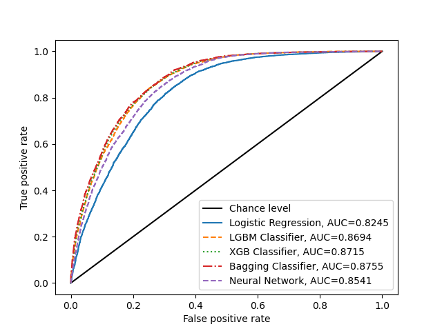

# Smoker Status Prediction using Bio-Signals

The notebook `main.ipynb` tackles Kaggle's [Smoker Status Prediction](https://www.kaggle.com/competitions/playground-series-s3e24/overview) challenge. It is structured into explorative data analysis, feature engineering, modeling and results.

## Dataset
The training [dataset](https://www.kaggle.com/competitions/playground-series-s3e24/overview) comprises the following 24 variables:

- `id`: Unique identifier for each data point.
- `age`: Age of the individual, categorized in 5-year intervals.
- `height(cm)`: Height of the individual in centimeters.
- `weight(kg)`: Weight of the individual in kilograms.
- `waist(cm)`: Waist circumference of the individual in centimeters.
- `eyesight(left/right)`: Eyesight measurements for the left and right eyes.
- `hearing(left/right)`: Hearing ability for the left and right ears, represented as binary.
- `systolic`: Systolic blood pressure measurement.
- `relaxation`: Diastolic blood pressure measurement.
- `fasting blood sugar`: Fasting blood sugar level.
- `Cholesterol`: Total cholesterol level.
- `triglyceride`: Triglyceride level.
- `HDL`: High-density lipoprotein cholesterol level.
- `LDL`: Low-density lipoprotein cholesterol level.
- `hemoglobin`: Hemoglobin level in the blood.
- `Urine protein`: Level of protein in urine, categorized.
- `serum creatinine`: Serum creatinine level.
- `AST`: Level of aspartate aminotransferase enzyme.
- `ALT`: Level of alanine aminotransferase enzyme.
- `Gtp`: Level of gamma-glutamyl transferase enzyme.
- `dental caries`: Presence (1) or absence (0) of dental cavities.
- `smoking`: Target variable indicating if the individual is a smoker (1) or not (0). Not present in the test set but can be evaluated on [Kaggle](https://www.kaggle.com/competitions/playground-series-s3e24/overview).

## Results

The different classifiers evaluated on Kaggle's private dataset:

Classifier | Result on Kaggle (AUC)
-------- | --------
Logistic Regression   | 0.825
LGBM   | 0.874
XGB   | 0.873
Bagging (XGB) | **0.875**
NN | 0.846

Below graph shows the AUC scores of the different classifiers evaluated on own test sets of the public dataset. Note that for the logistic regression barely any parameters are set to have a simple baseline. Also the neural network is far from being optimized.

  

## References

- Competition and dataset hosted by [Kaggle](https://www.kaggle.com/competitions/playground-series-s3e24/overview)
- Some hyperparameters and data visualization from [here](https://www.kaggle.com/code/yaaangzhou/pg-s3-e24-eda-modeling-ensemle-nn#6.-Hyperparameter-optimization-of-individual-models)
- Ideas on the neural network from [here](https://www.kaggle.com/code/sunilthite/binary-prediction-of-smoke-status-ml-algorithms/notebook#ANN)